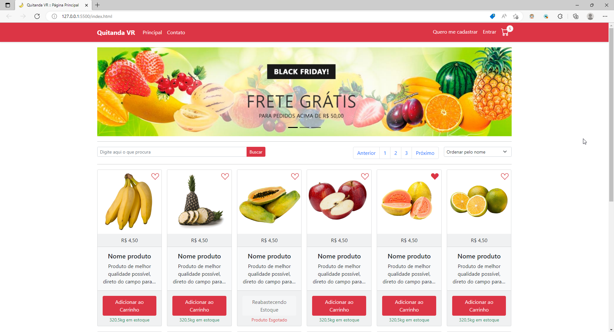
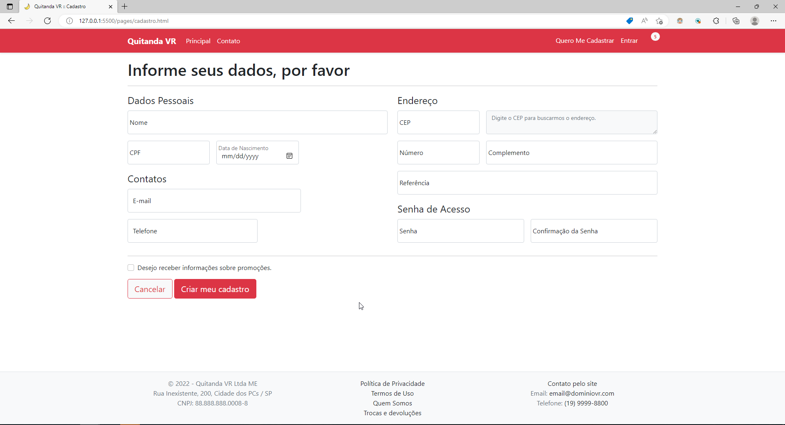
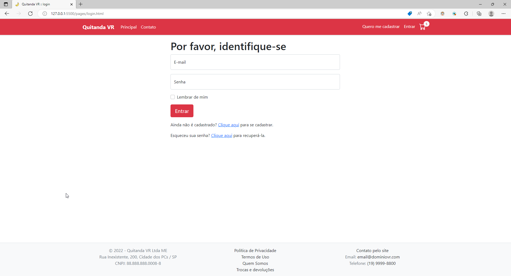
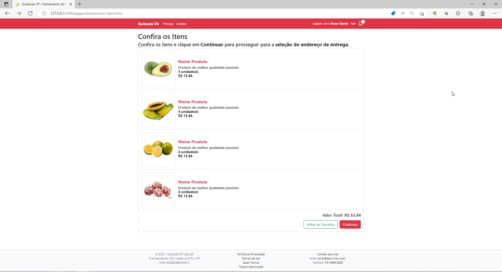
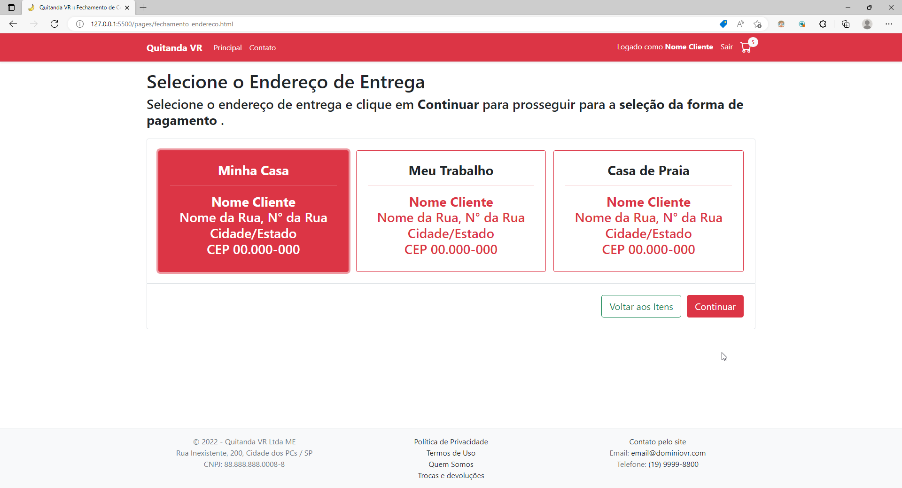
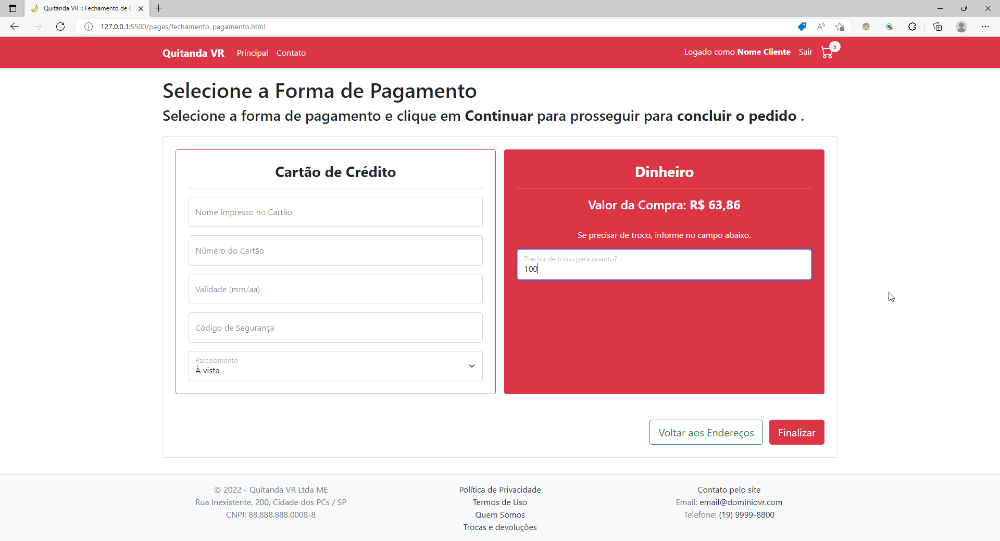
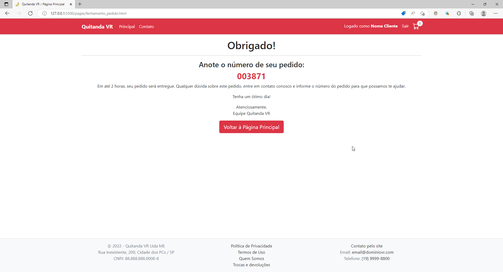
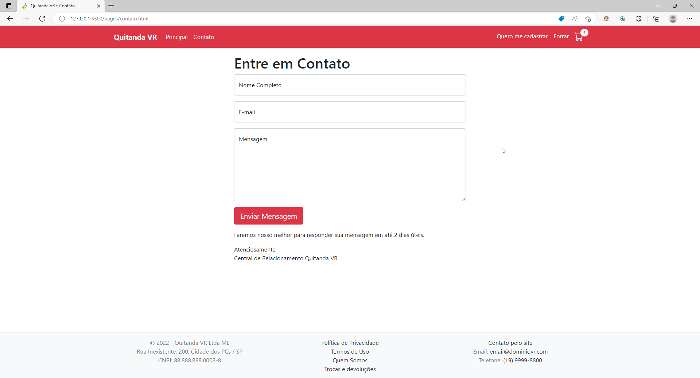

# Design Virtual Store

## Sobre o projeto

[Abrir / visualizar o projeto](https://design-loja-virtual.netlify.app/)

É um website construído para praticar conhecimentos obtidos durante o estudo de vídeo disponível no canal **[Ricardo Maroquio](https://www.youtube.com/c/RicardoMaroquio)**

Consiste no design de uma loja virtual (quitanda), onde é possível navegar entre as páginas do site. Não foi implementado nada relacionado a back-end / funcionalidades reais, só possui o design e navegação entre as diversas telas.

## Página inicial

## Página de cadastro

## Página de login

## Carrinho de compras

## Conferir itens

## Selecionar local de entrega

## Selecionar forma de pagamento

## Visualizar número do pedido

## Página de contato

# Tecnologias utilizadas
## Front end
- HTML
- CSS
- Javascript
- Boostrap
## Ferramentas
- Visual Studio Code
- Live Server (extensão p/ Visual Studio Code)

# Autor

Vinícius Rafael Machado Borges

[Linkedin](https://www.linkedin.com/in/viniborg/)

